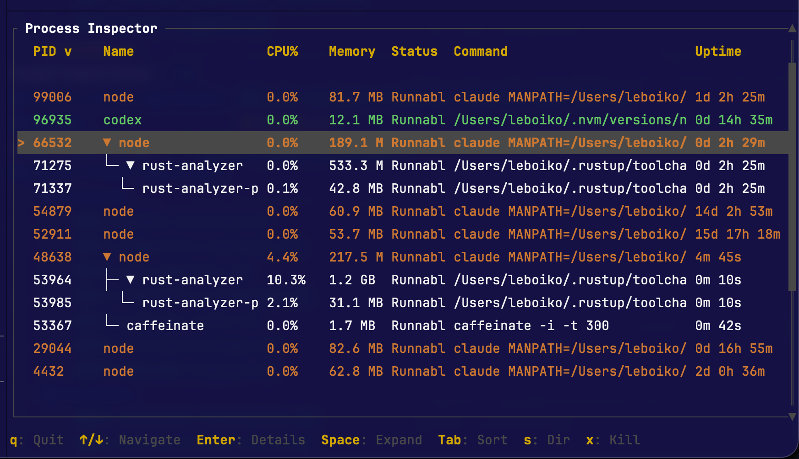

# agentop

A terminal UI (TUI) process inspector for macOS and Linux that monitors
running Claude Code and OpenAI Codex CLI processes. Displays an
expandable process tree with live CPU, memory, status, and uptime
metrics, and lets you drill into any process for sparkline charts and
full command-line details.

---

## Screenshot



The **tree view** lists every detected Claude / Codex root process in
orange (Claude) or green (Codex), with their child processes indented in
grey. Pressing `Enter` opens a **detail view** for the selected process,
showing CPU%, memory, full command line, and live sparkline charts over
the last 30 samples. Columns are sortable by pressing `Tab` to cycle
through them.

---

## Features

- **Cross-platform** — works on macOS and Linux.
- **Automatic detection** of Claude Code and OpenAI Codex CLI processes
  using multiple heuristics (process name, argv[0], exe path).
- **Process tree** built from OS parent-PID relationships, with
  expand/collapse support that persists across refresh cycles.
- **Sortable columns** — sort by PID, name, CPU%, memory, status, or
  uptime in ascending or descending order.
- **Live refresh** every 2 seconds on a background blocking thread, so
  the async UI reactor is never stalled.
- **Detail view** with per-process info table (CPU%, memory, exe path,
  working directory, environment variable count) and rolling sparkline
  charts for CPU and memory history.
- **Context-sensitive footer** showing only the key bindings relevant to
  the active view.
- **Safe terminal restoration** on both clean exit and panic.

---

## Installation

Requires [Rust](https://rustup.rs/) 1.70 or later.

### Install from crates.io (recommended)

```sh
cargo install agentop
```

### Install from GitHub

```sh
cargo install --git https://github.com/leboiko/agentop.git
```

### Install from a local clone

```sh
git clone https://github.com/leboiko/agentop.git
cd agentop
cargo install --path .
```

`cargo install` builds with `--release` by default, so the binary is
fully optimized (LTO, single codegen unit, stripped symbols) as
configured in the `[profile.release]` section of `Cargo.toml`.

### Verify installation

```sh
agentop --version   # or just: which agentop
```

If `~/.cargo/bin` is not on your `PATH`, add it:

```sh
# bash/zsh
echo 'export PATH="$HOME/.cargo/bin:$PATH"' >> ~/.zshrc
source ~/.zshrc
```

### Uninstall

```sh
cargo uninstall agentop
```

---

## Usage

```sh
agentop
```

The application opens in an alternate screen buffer (your terminal history
is not disturbed) and begins scanning immediately.

### Keybindings

#### Tree view

| Key            | Action                              |
|----------------|-------------------------------------|
| `q`            | Quit                                |
| `Ctrl+C`       | Quit (universal)                    |
| `Up` / `k`     | Move selection up                   |
| `Down` / `j`   | Move selection down                 |
| `Enter`        | Open detail view for selected row   |
| `Space`        | Expand / collapse selected node     |
| `Tab`          | Cycle sort column forward           |
| `Shift+Tab`    | Cycle sort column backward          |
| `s`            | Toggle sort direction (asc / desc)  |

#### Detail view

| Key       | Action              |
|-----------|---------------------|
| `Esc`     | Return to tree view |
| `q`       | Quit                |
| `Ctrl+C`  | Quit (universal)    |

---

## Process Detection

Detection logic is implemented in `src/process/filter.rs` and operates on
a snapshot of every process's name, argv, and exe path.

### Claude Code

A process is classified as Claude if **any** of the following conditions
hold:

1. `process.name == "claude"`
2. `argv[0] == "claude"` — catches cases where `sysinfo` reports the
   underlying engine name (e.g. `"node"`) instead of the display title.
3. The exe path contains `.local/share/claude` — covers the typical
   installation directory on Linux/macOS.
4. The process name consists entirely of digits and dots (a version string
   such as `"1.2.3"`) **and** the exe path contains `"claude/versions"` —
   matches versioned Electron bundles shipped by the installer.

### OpenAI Codex CLI

A process is classified as Codex if **any** of the following conditions
hold:

1. `process.name == "codex"`
2. `argv[0] == "codex"`
3. Any argv token contains `"@openai/codex"` or `"codex.js"` — catches
   `npx`-launched invocations where the process name is `"node"`.

All child processes (those whose parent PID matches a detected root) are
included in the tree regardless of their own name.

---

## Architecture

```
src/
  main.rs          Entry point; tokio runtime setup, event loop, scanner
                   channel wiring, and frame rendering dispatch.
  app.rs           Central application state (App) and all state mutations.
                   Translates Actions into state changes, manages history
                   ring buffers, and drives flat-list rebuilds.
  action.rs        Enum of all discrete user actions (Quit, MoveUp, ...).
  event.rs         Async EventHandler that multiplexes crossterm key events,
                   periodic Tick signals, and Render signals over a single
                   channel.
  tui.rs           Terminal initialisation / restoration helpers and the
                   panic hook that ensures raw mode is always cleaned up.
  process/
    info.rs        ProcessInfo struct: owned snapshot of one OS process.
    filter.rs      is_claude_process / is_codex_process predicates.
    scanner.rs     ProcessScanner wrapping sysinfo::System; incremental
                   refresh with CPU delta seeding.
    tree.rs        Forest construction from flat snapshots, flatten_visible,
                   and expand/collapse state helpers.
    mod.rs         Public re-exports.
  ui/
    tree_view.rs   Renders the scrollable Table with box-drawing tree
                   connectors, colour-coded rows, and a scrollbar.
    detail_view.rs Renders the detail panel: header, info table, CPU
                   sparkline, memory sparkline, and full command line.
    footer.rs      Context-sensitive one-line key-binding hint bar.
    format.rs      Shared formatting helpers (memory, duration).
    styles.rs      Shared Style / Color constants.
    mod.rs         Public re-exports.
```

The event loop runs at two independent rates: a **tick rate** of 2 seconds
triggers a background scan, and a **render rate** of ~30 fps drives
redraws. The scanner runs on a dedicated `tokio::task::spawn_blocking`
thread to avoid blocking the async reactor during `sysinfo` syscalls.

---

## Tech Stack

| Crate         | Version | Purpose                                      |
|---------------|---------|----------------------------------------------|
| `ratatui`     | 0.30    | TUI rendering framework                      |
| `crossterm`   | 0.29    | Cross-platform terminal I/O and event stream |
| `tokio`       | 1       | Async runtime, channels, spawn_blocking      |
| `sysinfo`     | 0.38    | Cross-platform process and system metrics    |
| `color-eyre`  | 0.6     | Error reporting and panic hook integration   |
| `strum`       | 0.26    | Enum utilities                               |
| `futures`     | 0.3     | Stream combinators for the event loop        |

---

## License

MIT
